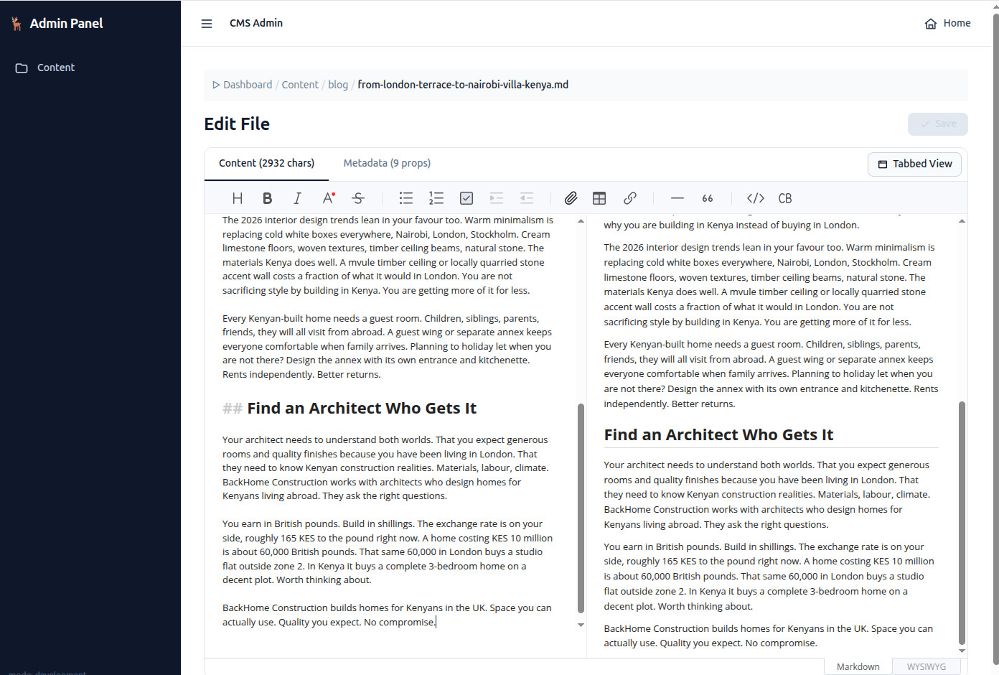

<!--
 Copyright (c) 2026 Anthony Mugendi

 This software is released under the MIT License.
 https://opensource.org/licenses/MIT
-->

# Moosey CMS 🫎
<p align="center">
  <a href="https://pypi.org/project/moosey-cms/">
    
  </a>
  <a href="https://pypi.org/project/moosey-cms/">
    
  </a>
  <a href="https://opensource.org/licenses/MIT">
    
  </a>
  <a href="https://pypi.org/project/moosey-cms/">
    
  </a>
  <a href="https://github.com/mugendi/moosey-cms">
    
  </a>
</p>

**A lightweight, drop-in Markdown CMS for FastAPI.**


Moosey CMS turns a FastAPI application into a content-driven website using Markdown files, YAML frontmatter, and Jinja templates - no database required.



## Features

- File-based Markdown content with automatic URL routing
- Jinja template resolution and sandboxed expressions
- Hot reloading and content-aware caching
- Visual admin for content, frontmatter, and static assets
- Git-backed file history, diff previews, and rollback
- SEO metadata, sitemaps, robots.txt, and RSS feeds
- Responsive image processing and CDN support
- JSON API for content management

## Installation

```bash
uv add moosey-cms
```

Or with pip:

```bash
pip install moosey-cms
```

## Quick start

Scaffold and run a complete site:

```bash
moosey-cms init ./my-site
cd my-site
moosey-cms dev
```

Open `http://localhost:8000`. To add the admin UI to an existing project:

```bash
moosey-cms admin --templates ./templates --static ./static
```

See [Getting Started](docs/getting-started.md) for manual FastAPI setup, optional dependencies, and production commands.

## Documentation

| Guide | Covers |
|---|---|
| [Getting Started](docs/getting-started.md) | Installation, setup, configuration, and the example app |
| [CLI](docs/cli.md) | Project scaffolding, admin installation, and server commands |
| [Admin Dashboard & API](docs/admin.md) | Admin UI, Git history, authentication, and JSON endpoints |
| [Templates](docs/templates.md) | Template resolution, layouts, collections, and pagination |
| [Frontmatter](docs/frontmatter.md) | Supported metadata and project overrides |
| [Markdown](docs/markdown.md) | Rendering and enabled Markdown extensions |
| [Filters](docs/filters.md) | Complete Jinja filter reference |
| [Images](docs/images.md) | Responsive images, transforms, face detection, and CDNs |
| [SEO](docs/seo.md) | Metadata, structured data, sitemaps, robots.txt, and feeds |
| [Security](docs/security.md) | Sanitization, CSP, template sandboxing, and deployment guidance |
| [Patterns](docs/patterns.md) | Practical project structures and conventions |

The [`example/`](example/) project is a working reference implementation.

## Development

```bash
uv sync
uv run pytest
```

Please report bugs and security issues through the [GitHub issue tracker](https://github.com/mugendi/moosey-cms/issues).

## License

MIT License. Copyright © 2026 Anthony Mugendi.

Inspired by [fastapi-blog](https://github.com/pydanny/fastapi-blog) by Daniel Roy Greenfeld.
